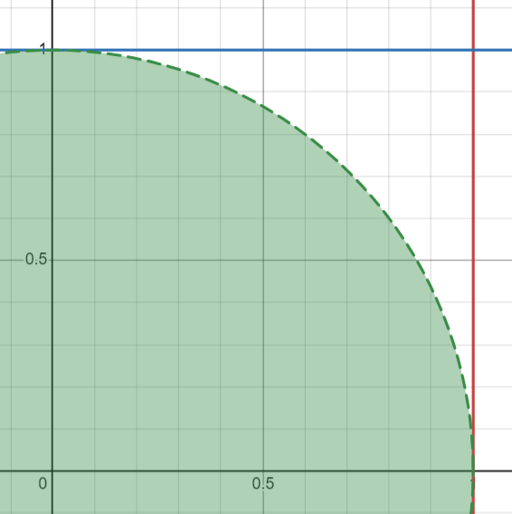

```{r}
set.seed(2024)
```

\section{1.}

\subsection{(a)}
```{r fig.height=4, fig.width=6}
x= seq(-3,3,length=1000)
densityx= dnorm(x)
plot(x, densityx, type="l",
     col="#bc3754", lty= 2, 
     ylab="Density", xlab= "X values", main="Normal + T Plot")
lines(x,dt(x,1),lwd=2, col= "yellow")
lines(x,dt(x,3),lwd=2, col= "blue")
lines(x,dt(x,8),lwd=2, col= "orange")
lines(x,dt(x,30),lwd=2, col= "green")
legend(x= "topright", lty= c(2,1,1,1,1),
       col= c("#bc3754", "yellow", "blue", "orange", "green"), 
       legend= c("N(0,1)", "df= 1", "df= 3", "df= 8", "df" )
       )
```

\subsection{(b)}
```{r fig.height=3.5, fig.width=6}
boxplot(rnorm(100), rt(100, df= 1), rt(100, df= 3),
        rt(100, df= 8), rt(100, df= 30))
```
\newpage

\section{2.}
Interpreting $U$ and $V$ (independent $Uniform(0,1)$) as co ordinates of a point on $\bm{R^2}$, we get a $1 \times 1$ unit square over the area $(0,0), (0,1), (1,1), (1,0)$.
Let $f_{U,V}$ denote the joint PDF.
We know, as $U$ and $V$ are independent, 
$$ f_{U,V}(u,v)= f_U(u) \times f_V(v) $$
Also, $U$ and $V$ both follow $Uniform(0,1)$, which means $f_U \equiv 1 \equiv f_V$
$$ \therefore f_{U,V} \equiv 1 \times 1 = 1 $$

\subsection{(a)}
$Z:= \sqrt{U^2+V^2}$ \
```{r echo=FALSE, out.width= "20%"}

```
$$ \therefore \; \bm{P}[Z< 1]= \bm{P}[\sqrt{U^2+V^2}< 1]= \int_0^1 \int_0^{\sqrt{1-v^2}} f_{U,V}(u,v)\; du\; dv $$
$$ = \int_0^1 \left(\int_0^{\sqrt{1-v^2}} 1\; du \right) \; dv= \int_0^1 \sqrt{1-v^2} \; dv $$
$$ = \frac{1}{2}\left[sin^{-1}v \right]_{v=0}^1 +\frac{1}{2}\left[v \sqrt{1-v^2} \right]_{v=0}^1 $$
$$ = \frac{1}{2}[sin^{-1}(1) -sin^{-1}(0)] +\frac{1}{2}[1\cdot\sqrt{0} -0\cdot\sqrt{1}]= \frac{1}{2} \left[\frac{\pi}{2} \right] = \frac{\pi}{4} $$
\newpage

\subsection{(b)}
```{r}
replicate(10, {
  u <- runif(10000)
  v <- runif(10000)
  sum((u^2+v^2) < 1) / 10000
})
```
Here we take $10000$ number pairs $(u.v)$ uniformly chosen from the interval $[0,1]$ and check if $u^2+v^2< 1$. Then we take the *emperical* probability of the number of pairs obtained by $10000$, which should be closely equal to the value we found in $2.(a)$, i.e. $\frac{\pi}{4}\approx 0.7854$

\subsection{(c)}
```{r}
replicate(10, {
  u <- runif(10000)
  v <- runif(10000)
  4*sum((u^2+v^2) < 1) / 10000
})
```
To estimate $\pi= 3.1413$ we just multiply the probability by $4$.
\newpage


\section{3.}

\subsection{(a)}
```{r}
x.means<- replicate(1000, mean(rnorm(50)))
#calculates the mean of 50 generated samples following Norm(0,1), approximately = 0.
#x.means is a vector storing 1000 such means using the replicate command.
library(package = "lattice")
#unpacks the features of the lattice package and enables us to use it.
histogram(~x.means, nint = 15) #plots a histogram of x.means with number of bins = 15.
#the frequency is represented through percentage of total.
```


\newpage
```{r}
qqmath(~x.means, grid = TRUE) 
```

The initial step involves generating 50 samples from a normal distribution and repeating this procedure 1000 times. The resulting data is then stored in the vector named x.means. \
Following that, the "lattice" package is loaded. Subsequently, a histogram is plotted with x.means represented on the y-axis, divided into 15 intervals. \
Finally, x.means is plotted on the y-axis against the corresponding normal samples on the x-axis.
\newpage

\subsection{(b)}
```{r fig.height=3.75, fig.width=6}
t.distribution= replicate(100, {
x.vector= rnorm(100)
x.mean= mean(x.vector)
x.variance= var(x.vector)
10*x.mean/sqrt(x.variance)
})
histogram(t.distribution, nint= 30)
dt(t.distribution, df= 99)
```
\newpage
```{r}
library(tidyverse)
```
\newpage
```{r}
tdist= data.frame(t.distribution)
ggplot(tdist) + 
  geom_histogram(mapping= aes(x= t.distribution,
                              y= after_stat(density)), 
                 color ="black", fill= "lightblue", bins= 30) +
  geom_line(aes(x= t.distribution, 
                y= dt(t.distribution, df=99)),
            color="darkred")
```
\newpage

**BOOK KEEPING EXERCISES**


